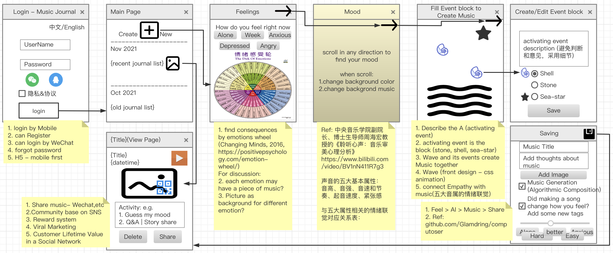
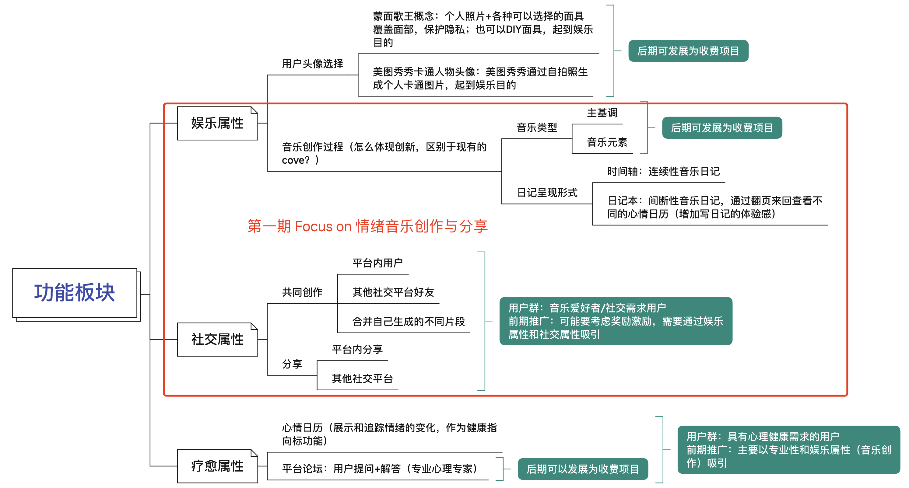
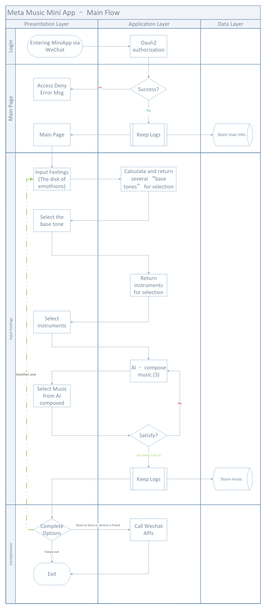

## Welcome to MetaMusic (疗愈音乐社区)

该网站用于介绍MetaMusic项目, 使用Github Page制作, 网站将会不断更新.

- 准备期 (11~12月)主要内容为团队成员间的分享讨论 - 并输出最终的Proposal
- 第一期 (2022.1~4月) 第一阶段产品上线
- 第二期 (2022.5~7月) 完善产品, 初步运营
- 第三期 (2022.8后) 开源运营

### About us

我们是香港大学ECom&ICom专业的研究生, MetaMusic是我们这个小组的毕业项目, 同时也是一个开源项目, 如果你对这个项目感兴趣, 欢迎你的加入!

#### How to Join us

现阶段可直接邮件Xia JF申请加入, 团队成员编辑网站步骤:
1. 申请[GitHub 账号](https://github.com/signup)
2. 将账号名称发给 Xia JF 开通权限
3. You can use the [editor on GitHub](https://github.com/meta-music/project/blob/gh-pages/index.md) to maintain and preview the content for your website in Markdown files. 

#### Group Members

1. Liu Shu
2. Ning Jiafeng
3. Wu Chenjun
4. Xia Jianfeng
5. Yao Mengting

### 项目Proposal

项目名称：MetaMusic - 一个基于音乐的心理保健社区
项目开始时间：2021 年 12 月
问题：IT如何为心理亚健康人群普及认知行为疗法？
想法：在在线心理保健社区中通过音乐日记开发和实践认知行为疗法。
目标用户：心理亚健康人群

#### 介绍

香港大学的一项调查显示：[97%的香港市民健康状况不佳](https://www.hkupop.hku.hk/english/report/subhealth/content/resources/pr.pdf)[ ^1]，而中国科学院心理研究所的统计结果显示，中国70%以上的人处于心理亚健康状态。越来越多的人开始意识到这个警告信号，并前往医院就诊。然而，特别是在大陆，医院相关资源短缺，往往需要4到6个月的时间才能预约。这个项目——MetaMusic，旨在通过IT与音乐日记、[认知行为疗法](https://betterhumans.coach.me/cognitive-journaling-a-systematic-method-to-overcome-negative-beliefs-119be459842c)[^2] 和可分享的[即兴音乐疗法](https://my.clevelandclinic.org/health/treatments/8817-music-therapy )[^3]等技术整合，帮助更多受到心理亚健康困扰的人。

##### 心理保健的心理治疗

认知行为疗法 (CBT) 是一种心理治疗形式，已被证明与其他形式的心理疗法或精神科药物一样有效，用于治疗包括抑郁症、焦虑症、婚姻问题、饮食障碍和严重的精神疾病等一系列问题。 CBT 强调帮助个人学习成为自己的治疗师。大量研究表明，CBT 可显着改善心理健康和生活质量。[^6] 然而，CBT 需要一些基本的心理技能，除非你特别擅长自我调节，否则很难坚持下去。

##### 用 IT 将音乐和 CBT 集成到心理疗愈中

人们总是因为忽略了他们情感背后的信念而难以控制情绪，然而，听音乐能够很好的舒缓人们的情绪。音乐是人类与生俱来的能力，它可以帮助大多数人获得更好的心理健康。此外，通过音乐日记开发和练习情绪调节可以整合认知行为疗法——帮助人们挑战和建立更好的信念。随着技术的发展，算法作曲和/或音乐游戏已经成为一种最容易学习和使用的新工具——有一些开源框架，包括[Tone.js](https://apps.musedlab.org /groovepizza/?museid=kngevZcmc&)[^4] 和 [洋红色](https://experiments.withgoogle.com/ai/ai-duet/view/)[^5]。该项目将应用这些开源框架和游戏化（通过音乐）CBT 在智能手机上提供心理保健。最后，该项目将开源，所有的小组操作、会议记录、活动和计划都在[meta-music.github.io](https://meta-music.github.io/project/)上展示。

### Project Proposal

Project title:  MetaMusic - A Music-based Mental Healthcare Community

Project start: December 2021

Problem:  How IT can popularize cognitive behavioral therapy for mental sub-health people?

Idea:  Develop and practice emotional regulation by music diary in an online Mental Healthcare Community. 

Intended impact: Mental sub-health people

#### Introduction

The university of Hong Kong made a survey revealed:  [97% Hong Kong citizens have sub-optimal health](https://www.hkupop.hku.hk/english/report/subhealth/content/resources/pr.pdf)[^1], and statistical results of the Psychological Institute of the Chinese Academy of Sciences show that more than 70% of China is in mental sub-health. More and more people began to realize this warning signs, and go to the hospital. However, Especially in the mainland, there is a shortage of hospital-related resources, which often takes 4 to 6 months to make an appointment. Therefore, this project - MetaMusic, aims to help more people who are troubled by mental sub-health through IT and some other technology integration such as music diary, computerized [cognitive behavioral therapy](https://betterhumans.coach.me/cognitive-journaling-a-systematic-method-to-overcome-negative-beliefs-119be459842c)[^2] and shareable [improvisational music therapy](https://my.clevelandclinic.org/health/treatments/8817-music-therapy)[^3].

#####  Psychological Treatment for Mental Healthcare

Cognitive behavioral therapy (CBT) is a form of psychological treatment that has been demonstrated to be as effective as, or more effective than, other forms of psychological therapy or psychiatric medications for a range of problems including depression, anxiety disorders, marital problems, eating disorders, and severe mental illness. CBT places an emphasis on helping individuals learn to be their own therapists. Numerous research studies suggest that CBT leads to significant improvement in functioning and quality of life.[^6] However, CBT require some basic psychological skills and difficult to persist unless you are particularly good at self-regulation. 

##### Integrating Music Diary and CBT into Mental Healthcare using IT

People always not really get the meaning of their emotion, but can feel better when they listen to music. Music is the innate ability of human beings which can help most people to get better mental health. Moreover, developing and practicing emotional regulation by music diaries can integrate cognitive behavioral therapy - help people to challenge and build better beliefs. With the development of technology, algorithmic composition and/or music games has become a new instrument that is most easy to learn and use - there are some open-source framework including [Tone.js](https://apps.musedlab.org/groovepizza/?museid=kngevZcmc&)[^4] and [magenta](https://experiments.withgoogle.com/ai/ai-duet/view/)[^5]. This project will apply those open-source framework, and gamifying (by music) CBT to deliver mental healthcare on smartphones. Finally, the project will be open source, and all group operations, meeting records, activities, and plans are showing on [meta-music.github.io](https://meta-music.github.io/project/). 

[^1]: H. Kong, ‘97% Hong Kong citizens have sub-optimal health Working adults ignore warning signs at their peril Impacting Two thirds of the general population’, p. 4.
[^2]: R. R. Psychiatrist MD, ‘Cognitive Journaling: A Systematic Method to Overcome Negative Beliefs’, *Medium*, Oct. 12, 2021. https://betterhumans.pub/cognitive-journaling-a-systematic-method-to-overcome-negative-beliefs-119be459842c (accessed Oct. 21, 2021).
[^3]: ‘Music Therapy: What Is It, Types & Treatment’, *Cleveland Clinic*. https://my.clevelandclinic.org/health/treatments/8817-music-therapy (accessed Dec. 1, 2021).
[^4]: ‘Tone.js’. https://tonejs.github.io.
[^5]:  ‘Magenta’, Google AI. https://magenta.tensorflow.org
[^6]: ‘What is Cognitive Behavioral Therapy?’, American Psychological Association. https://www.apa.org/ptsd-guideline/patients-and-families/cognitive-behavioral (accessed Oct. 21, 2021).



### Discussion

1. 产品名和Logo是什么? - MetaMusic
2. 项目或产品故事是什么?
3. 商业模式是什么?
4. 产品核心功能是什么?
5. 如何在项目中应用所学?
7. 不断添加中...

#### Business Model Discussion

1. Unique Value Proposition - We are the ＿＿＿ in ＿＿＿ for ＿＿＿ because we do ＿＿＿ better than anyone else. 
2. ECOM7121 & ECOM6029
3. ECOM6014 - E-Marketing
4. etc

#### ECOM & ICOM Tech Discussion

Apply what we learned to project

1. COMP7404 - AI & Music (also COMP7103 & ICOM6044)
2. ECOM6013 - IT Project Management 
3. ICOM6034 - Website engineering
4. ICOM6046 - Knowledge graph
5. ECOM7123 - Open Data

#### Meeting

2021.12.23 Kick off meeting 

Todo:
1. Liu Shu:
   1. Application Process Diagram
2. Yao Mengting
   1. Function desc
3. Ning Jiafeng
   1. Function mindmap
4. Xia Jianfeng:
   1. Docs Uploads
   2. App list
   3. Papers
   4. Proposal

2022.1.4 Proposal Discussion and Workshop





Todo:

1. Liu Shu:
   1. Proposal Review
2. Yao Mengting
   1. Business Model canvas
3. Ning Jiafeng
   1. Function mindmap to Function roadmap
4. Wu Chenjun
   1. AI apply - idea
5. Xia Jianfeng:
   1. Proposal Update

### Markdown 格式文档使用指引

Markdown is a lightweight and easy-to-use syntax for styling your writing. It includes conventions for

```markdown
Syntax highlighted code block

# Header 1
## Header 2
### Header 3

- Bulleted
- List

1. Numbered
2. List

**Bold** and _Italic_ and `Code` text

[Link](url) and 
```

For more details see [Basic writing and formatting syntax](https://docs.github.com/en/github/writing-on-github/getting-started-with-writing-and-formatting-on-github/basic-writing-and-formatting-syntax).


## Reference